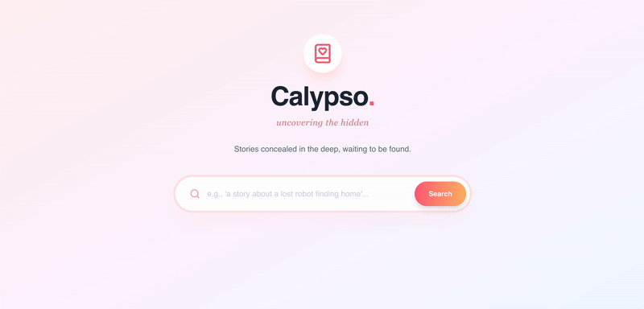

<!-- PROJECT SUMMARY -->
<div align="center">
  <h1 align="center">Calypso 🧜🏼‍♀️</h1>

  <p align="center">
    A semantic book recommender that uncovers the "vibe" of your next favorite read with Vector Embeddings and AI.
    <br>
    <a href="https://github.com/librariium/calypso/issues">» submit a suggestion </a>
    ·
    <a href="https://github.com/librariium/calypso/issues">» report a bug </a>
    ·
    <a href="https://github.com/librariium/calypso">» contact </a>
  </p>

  <div align="center">

 

[](https://github.com/librariium/calypso/actions/workflows/push_on_main.yml)
   

  </div>
</div>

<details open="open">
  <summary><h2 style="display: inline-block">🕹 Table of Content</h2></summary>
  <ol>
    <li>
      <a href="#🌻-about">About</a>
      <ul>
        <li><a href="#🔧-tech-stack">Tech Stack</a></li>
        <li><a href="#🍄-features">Features</a></li>
      </ul>
    </li>
    <li>
      <a href="#🌵-documentation">Documentation</a>
      <ul>
        <li><a href="#🍯-setup">Setup</a></li>
        <li><a href="#🍎-development">Development</a></li>
      </ul>
    </li>
    <li><a href="#🌾-contributing">Contributing</a></li>
    <li><a href="#📜-license">License</a></li>
  </ol>
</details>

## :sunflower: About
A "vibe matcher" for books, integrating modern AI/ML workflows (Python/FastAPI) with consumer-facing web applications (Next.js). Calypso uses semantic search to understand the emotional context of a user's request. By leveraging vector embeddings (`all-MiniLM-L6-v2`) and the `Hardcover.app` API, it allows users to search for natural language queries like *"A sci-fi about loneliness in space"* or *"A mystery that feels like a rainy day in London"* and retrieve statistically relevant matches.

### :hammer_and_wrench: Tech Stack

#### :heavy_plus_sign: Development Tools

- [x] **Visual Studio Code** : IDE
- [x] **Git & GitHub** : Version control
- [x] **Postman** : API endpoint testing
- [x] **Swagger UI** : API documentation & interactive testing

#### :heavy_plus_sign: Backend (AI & API)

- [x] **FastAPI/Python** : High-performance web framework
- [x] **LangChain** : Orchestration for AI models
- [x] **Pinecone** : Vector Database for semantic indexing
- [x] **Hardcover API** : Live metadata fetch (GraphQL)
- [x] **Sentence Transformers** : Local embedding generation

#### :heavy_plus_sign: Frontend

- [x] **Next.js 14+** : React
- [x] **TypeScript** : Static type checking & interfaces
- [x] **Tailwind CSS** : Utility-first styling system
- [x] **Axios/Fetch** : HTTP client for API requests

#### :heavy_plus_sign: DevOps

- [x] **Vercel** : Frontend Deployment
- [x] **Render / Railway** : Backend Deployment
- [x] **Kaggle** : Dataset sourcing

### :mushroom: Features

#### :heavy_plus_sign: Semantic Search Engine

- [x] **Natural Language Querying:** Users can type sentences describing a plot or feeling, not just keywords.
- [x] **Vector-Based Retrieval:** Uses cosine similarity to find books with matching "vibes" in the vector space.

### :bar_chart: Hybrid Data Pipeline

#### :heavy_plus_sign: Static Ingestion (Current Phase)
Our core search functionality relies on a pre-built vector index derived from a curated dataset.

- [x] **Dataset:** Sourced from Kaggle (`7k-books-with-metadata`), containing titles, authors, descriptions, and thumbnails.
- [x] **Preprocessing:** - Data cleaning via `pandas` to remove null values and standardize category tags.
  - "The Deep Clean" logic ensures no broken records enter the database.
- [x] **Vectorization:** - We use **Sentence Transformers** (`all-MiniLM-L6-v2`) to convert book descriptions + titles into 384-dimensional dense vectors.
- [x] **Indexing:** - Vectors are upserted to a **Pinecone Serverless Index** (`calypso-books`) using Cosine Similarity.
  - Metadata (Title, Author, Description) is stored alongside vectors for single-shot retrieval (avoiding a secondary database lookup).

#### :heavy_plus_sign: Live Enrichment (Future Phase)
To overcome the limitations of a static CSV (low-res images, outdated ratings), we are building a hybrid pipeline.

## :joystick: Demo

<div align="center">
  
</div>

## :cactus: Documentation

### :honey_pot: Setup

1. **Clone the repository**
   ```bash
    git clone [https://github.com/librariium/calypso.git](https://github.com/librariium/calypso.git)
    cd calypso
   ```

2. **Backend**
   ```bash
    cd backend
    python3 -m venv venv
    source venv/bin/activate
    pip install -r requirements.txt
   ```

3. **Frontend**
   ```bash
    cd ../frontend
    npm install
   ```

### :apple: Development
<!-- Add development details here -->
* Run Backend: cd backend && uvicorn main:app --reload
* Run Frontend: cd frontend && npm run dev
* API Docs: Access Swagger UI at http://localhost:8000/docs

<!-- CONTRIBUTING -->
## :ear_of_rice: Contributing
<!-- Add contribution guidelines here -->
> 1. Fork the Project
> 2. Create your Branch (`git checkout -b my-branch`)
> 3. Commit your Changes (`git commit -m 'add my contribution'`)
> 4. Push to the Branch (`git push --set-upstream origin my-branch`)
> 5. Open a Pull Request

<!-- LICENSE -->
## :pencil: License
<!-- Add license information here -->
This project is licensed under [LICENSE](https://opensource.org/licenses).

<!-- Gratitude to [source]() for the inspiration and insights. -->

<!-- ACKNOWLEDGEMENTS -->
<!-- ## Acknowledgements -->
